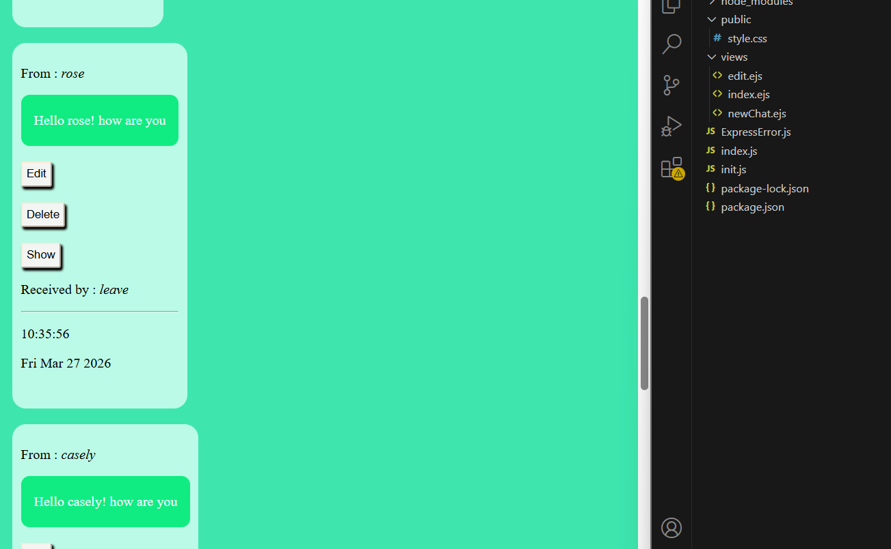

# Mini WhatsApp 💬

A simple **Mini WhatsApp Clone** built using **Node.js, Express.js, MongoDB, Mongoose, EJS, and CSS**.  
This project performs basic **CRUD operations** where users can create, edit, view, and delete chat messages.

---

## 🚀 Features

- 📩 Create new chats/messages
- ✏️ Edit existing chats
- 🗑️ Delete chats
- 👀 View chat details
- 🕒 Message timestamp support
- 💾 MongoDB database integration
- 🎨 Simple and clean UI

---

## 🛠️ Tech Stack

### Frontend
- HTML
- CSS
- EJS

### Backend
- Node.js
- Express.js

### Database
- MongoDB
- Mongoose

---

## 📂 Project Structure

```bash
Mini-Whatsapp/
│
├── models/
│   └── chat.js
│
├── public/
│   └── style.css
│
├── views/
│   ├── index.ejs
│   ├── newChat.ejs
│   ├── edit.ejs
│   └── show.ejs
│
├── node_modules/
├── ExpressError.js
├── index.js
├── init.js
├── package.json
└── package-lock.json


🧠 Concepts Used

RESTful Routing
CRUD Operations
Express Middleware
EJS Templating
MongoDB Database
Mongoose Models & Schemas
Method Override
Dynamic Rendering


📸 Preview

Mini WhatsApp interface with:

Chat cards
Edit/Delete/View buttons
Sender & Receiver information
Timestamp display


🔮 Future Improvements

🔐 User Authentication
💬 Real-time messaging using Socket.io
📱 Responsive mobile design
😊 Emojis support
🖼️ Profile pictures
☁️ Deployment on Render/Netlify


👩‍💻 Author

Himani Yadav

GitHub: [himaniyadav-git](https://github.com/himaniyadav-git)
LinkedIn: [himani-yadav-1098](https://www.linkedin.com/in/himani-yadav1098/)


⭐ Support

If you liked this project, give it a ⭐ on GitHub!
